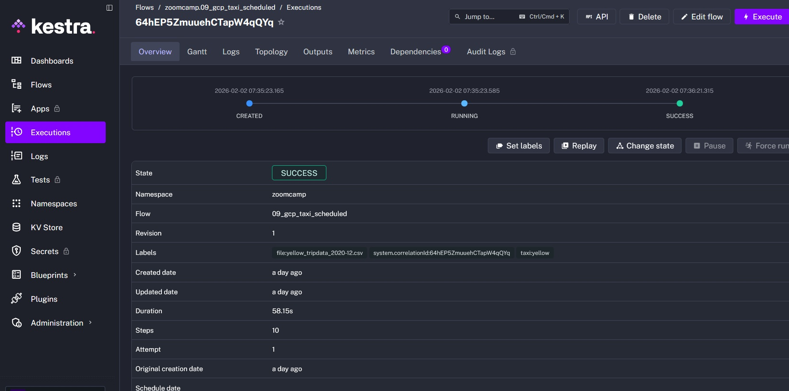
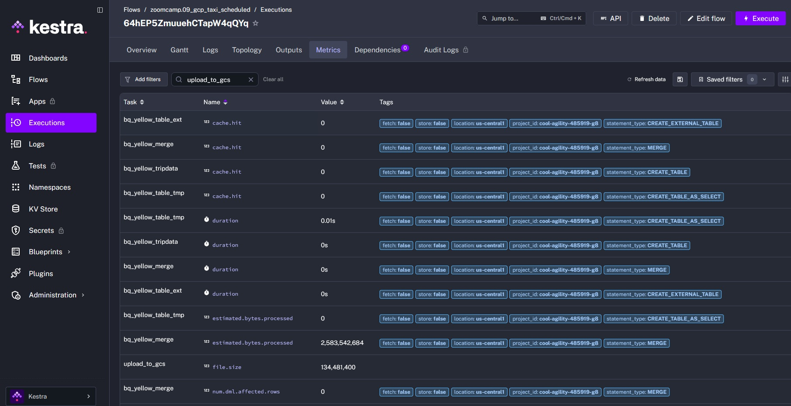
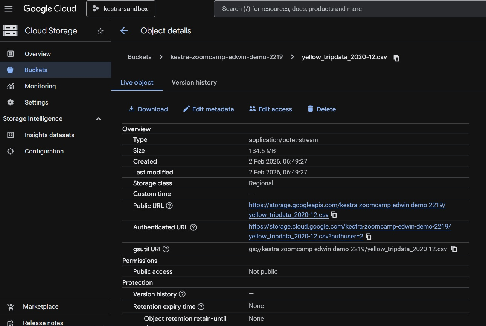
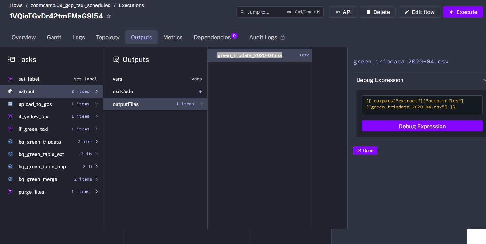
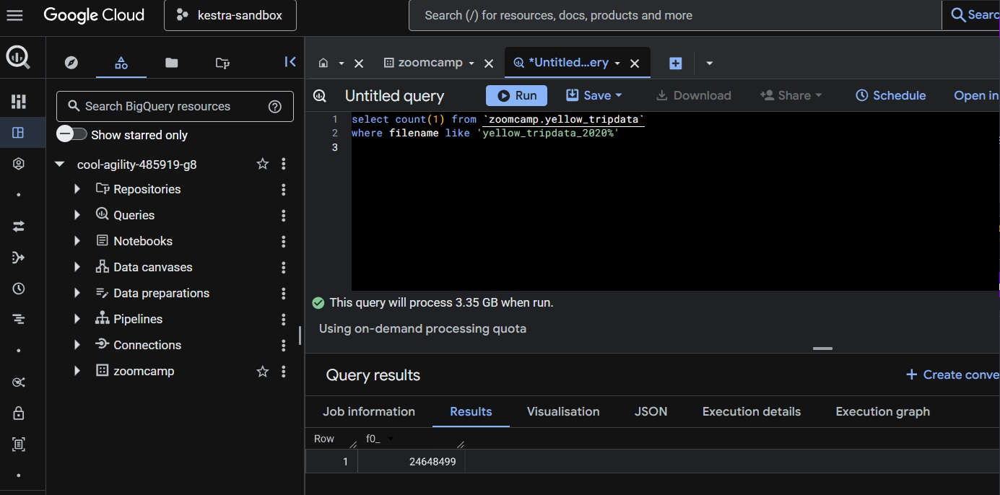
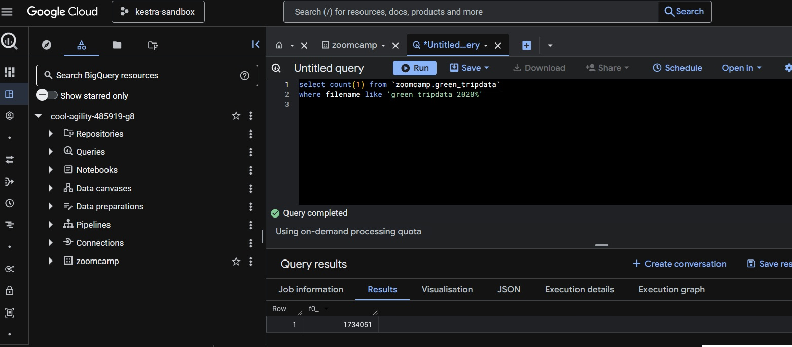
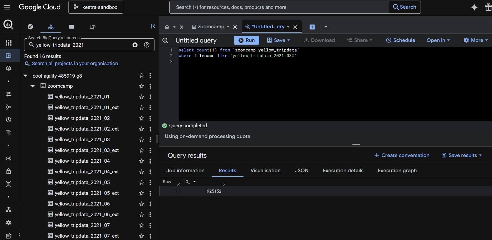
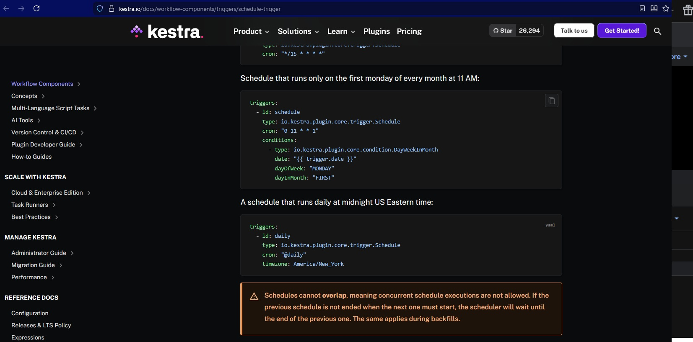

### Question 1

#### 1. Within the execution for Yellow Taxi data for the year 2020 and month 12: what is the uncompressed file size (i.e. the output file yellow_tripdata_2020-12.csv of the extract task)?





**Ans:** 134.5 MiB


### Question 2

#### 2. What is the rendered value of the variable file when the inputs taxi is set to green, year is set to 2020, and month is set to 04 during execution?



**Ans:** green_tripdata_2020-04.csv


### Question 3

#### 3. How many rows are there for the Yellow Taxi data for all CSV files in the year 2020?



```sql
select count(1) from `zoomcamp.yellow_tripdata`
where filename like 'yellow_tripdata_2020%';
```

**Ans:** 24,648,499


### Question 4

#### 4. How many rows are there for the Green Taxi data for all CSV files in the year 2020?



```sql
select count(1) from `zoomcamp.green_tripdata`
where filename like 'green_tripdata_2020%';
```

**Ans:** 1,734,051


### Question 5

#### 5. How many rows are there for the Yellow Taxi data for the March 2021 CSV file?



```sql
select count(1) from `zoomcamp.yellow_tripdata`
where filename like 'yellow_tripdata_2021-03%';
```


**Ans:** 1,925,152


### Question 6

#### 6. How would you configure the timezone to New York in a Schedule trigger?

Source: https://kestra.io/docs/workflow-components/triggers/schedule-trigger


**Ans:** Add a timezone property set to America/New_York in the Schedule trigger configuration


