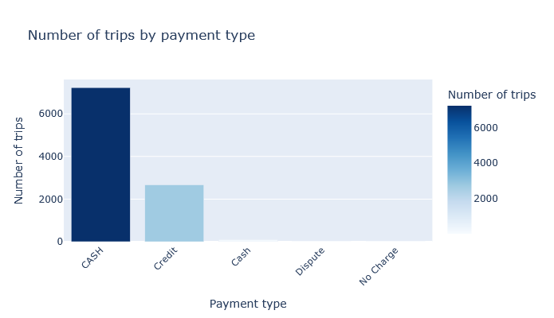
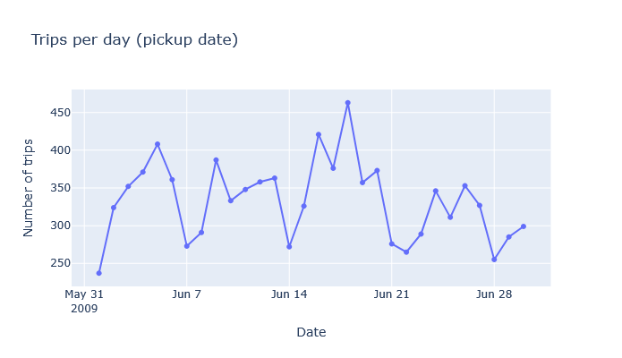
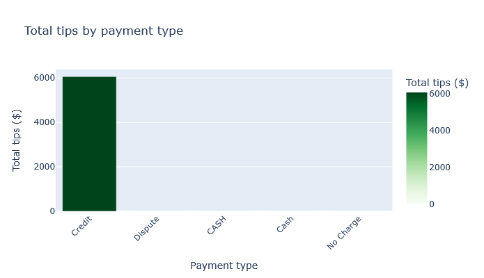

# NYC Taxi Pipeline

Pipeline that loads NYC taxi trip data from a REST API into DuckDB using [dlt](https://dlthub.com).

---

## Getting started

```bash
mkdir taxi-pipeline
cd taxi-pipeline

uv init
uv add "dlt[workspace]"
uv run dlt init dlthub:taxi_pipeline duckdb

uv run python taxi_pipeline.py

uv run dlt pipeline taxi_pipeline show
```

---

## Explore data with Marimo (charts)

Using [dlt + Marimo](https://dlthub.com/docs/general-usage/dataset-access/marimo), you can build reactive notebooks and dashboards on top of the pipeline data.

1. **Install deps** (from `taxi-pipeline`): `uv sync`
2. **Start Marimo** and open the notebook: `marimo edit explore_taxi.py`
3. The notebook includes:
   - **Bar chart**: Number of trips by payment type
   - **Line chart**: Trips per day (pickup date)
   - **Bar chart**: Total tips by payment type

Run the pipeline first so `taxi_pipeline.duckdb` exists in this directory.

```bash
marimo edit explore_taxi.py
```

The charts below in the workshop answers were generated from this Marimo notebook.

---

## Data quality: duplicate check

The script `check_duplicates.py` validates that the pipeline is not inserting the same trip data more than once into DuckDB. It compares total row count to the count of distinct trips (by pickup time, coordinates, dropoff time, and fare) and reports whether any duplicates were detected. Run it after a pipeline run:

```bash
uv run python check_duplicates.py
```

---

## Workshop questions & answers

Answered using the **dlt MCP Server** (`execute_sql_query` on `taxi_pipeline`). You can also use `dlt pipeline taxi_pipeline show` (CLI) or a Marimo notebook. The figures below were generated in Marimo.

### Question 1: What is the start date and end date of the dataset?

- 2009-01-01 to 2009-01-31
- **2009-06-01 to 2009-07-01** ✓
- 2024-01-01 to 2024-02-01
- 2024-06-01 to 2024-07-01

**Answer:** **2009-06-01 to 2009-07-01**. The data spans June 2009 (min pickup `2009-06-01`, max pickup `2009-06-30`).

**How:** `SELECT MIN(trip_pickup_date_time), MAX(trip_pickup_date_time), count(1) FROM trips`

| MIN(trip_pickup_date_time) | MAX(trip_pickup_date_time) | count(1) |
|----------------------------|----------------------------|----------|
| 2009-06-01T11:33:00Z       | 2009-06-30T23:58:00Z       | 10,000   |



---

### Question 2: What proportion of trips are paid with credit card?

- 16.66%
- **26.66%** ✓
- 36.66%
- 46.66%

**Answer:** **26.66%**. Credit card (`payment_type = 'Credit'`) is 2,666 trips out of 10,000 total → 2,666/10,000 = 26.66%.

**How:** `SELECT payment_type, COUNT(*) FROM trips GROUP BY payment_type`, then proportion for `Credit`.

| payment_type | COUNT(*) |
|--------------|----------|
| Dispute      | 1        |
| Credit       | 2,666    |
| Cash         | 97       |
| No Charge    | 1        |
| CASH         | 7,235    |

**Note:** There are two labels for cash — **Cash** (97) and **CASH** (7,235). For a single “cash” total use `LOWER(payment_type) = 'cash'` or `payment_type IN ('Cash', 'CASH')`.



---

### Question 3: What is the total amount of money generated in tips?

- $4,063.41
- $6,063.41
- $8,063.41
- $10,063.41

**Answer:** **$6,063.41**. Sum of `tip_amt` over all trips.

**How:** `SELECT SUM(tip_amt) AS total_tips FROM trips`

| total_tips  |
|-------------|
| 6,063.41    |



---

## Questions for dlt MCP server

- List tables in taxi_pipeline and show the schema of the trips table.
- Run `SELECT COUNT(*), COUNT(DISTINCT trip_pickup_date_time \|\| fare_amt) FROM trips` on taxi_pipeline.
- Search dlt docs for: REST API page_number paginator page_param base_page stop_after_empty_page.
- What’s the pipeline state for taxi_pipeline? Show last run and destination.
- Display the schema of taxi_pipeline as a diagram and hide columns.
